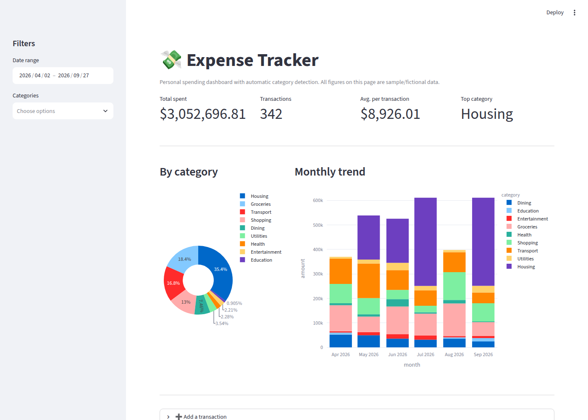

# Expense Tracker Dashboard

A personal expense tracker with automatic category detection, built in
[Python](https://www.python.org) with [Streamlit](https://streamlit.io)
and [Plotly](https://plotly.com/python/). It's a small, self-contained
companion piece to [n8n-request-tracker](https://github.com/facundosarina/n8n-request-tracker),
showing the same "turn manual, repetitive work into something automatic"
approach applied with plain Python instead of a no-code workflow tool.

**Live demo:** https://facundosarina-expense-tracker.streamlit.app/

Sample data is fictional — no real financial information is included.

## Problem it solves

Tracking personal (or small business) spending by hand means manually
tagging every transaction with a category before you can see where the
money actually goes. That step is tedious and easy to skip, which is
usually why the spreadsheet stops getting updated after a few weeks.

This app removes that step: every transaction — typed in one at a time or
imported in bulk from a CSV — gets a category guessed automatically from
its description, and the dashboard updates immediately.

## How it works

1. **Automatic categorization (`categorizer.py`)** — a small rule-based
   engine matches each transaction's description against a keyword table
   (e.g. "UBER", "COTO SUPERMERCADO", "NETFLIX") and returns the most likely
   category. No ML model or external API — just a readable, easy-to-extend
   set of rules. Keywords cover both English and Spanish merchant names,
   since real bank statements are rarely in a single language.
2. **Manual entry** — add one transaction at a time through a form; the
   category is suggested as you type and can always be overridden.
3. **Bulk import** — upload a CSV with `date, description, amount` and every
   row gets auto-categorized before it's added, with a preview so you can
   check the results first.
4. **Dashboard (`app.py`)** — filter by date range and category, and see:
   total spent, transaction count, average transaction, top category, a
   by-category breakdown, and a month-by-month trend.



## Try it / reuse it

```bash
pip install -r requirements.txt
python generate_sample_data.py   # optional: creates fictional sample data
streamlit run app.py
```

Then open the local URL Streamlit prints (usually `http://localhost:8501`).

To adapt it to your own spending, either edit `data/expenses.csv` directly,
or clear it and use the "Add a transaction" / "Import transactions from CSV"
sections in the app. To add or tweak categories, edit `CATEGORY_RULES` in
`categorizer.py` — it's a plain dictionary of `category -> keywords`.

## Known limits

- **Categorization is keyword-based, not ML-based.** It's transparent and
  easy to extend, but a merchant name it has never seen (and that doesn't
  contain any known keyword) falls back to "Other" until a matching keyword
  is added.
- **Storage is a single CSV file**, not a database — fine for personal use
  at this scale, but a multi-user or high-volume version should move to a
  proper database.
- **No multi-currency support** — amounts are treated as a single currency
  throughout.

## Stack

Python · Streamlit · Pandas · Plotly.

## About me

I build automations that take manual, repetitive work — form intake,
document requests, case tracking, spending/data organization — and turn it
into a process that runs itself. Before automation I spent 8+ years running
exactly this kind of process by hand in an administrative/legal setting,
so I know firsthand which parts actually need to be reliable.

Available for freelance automation work — [Workana](https://www.workana.com/freelancer/e77e2133ac2a73aacd51029bb5e7f473) · [LinkedIn](https://www.linkedin.com/in/facundo-sarina/)
